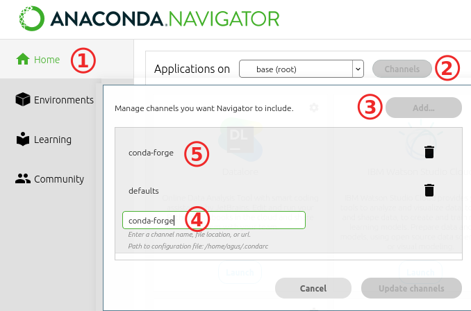
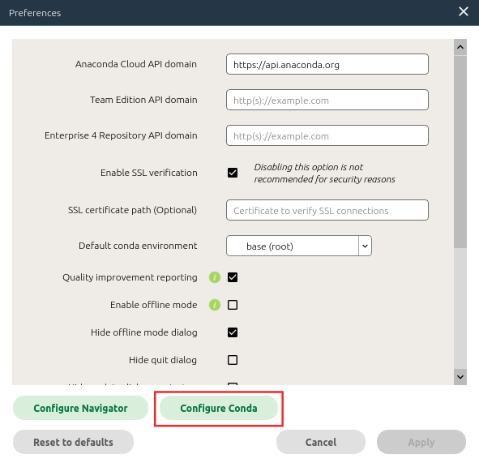
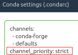
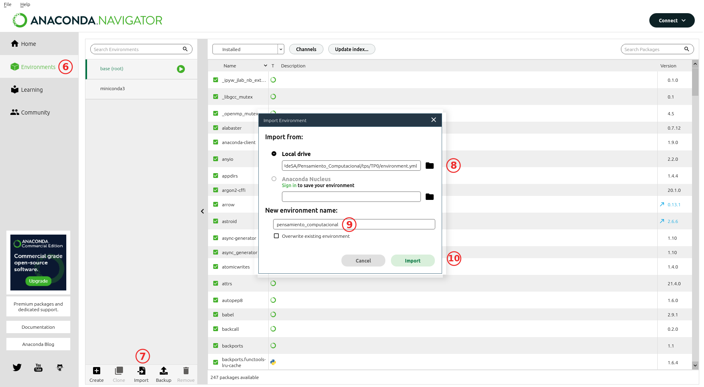
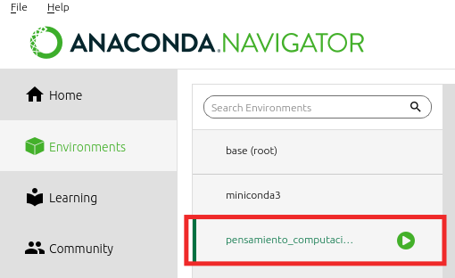
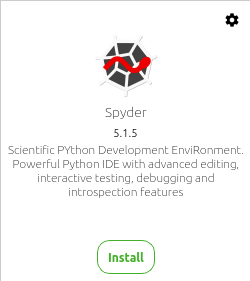
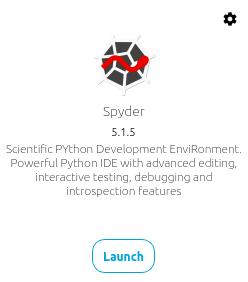
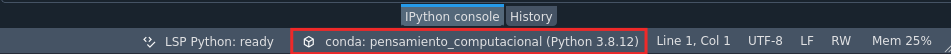
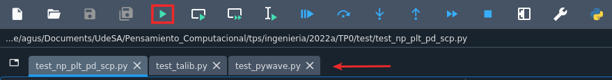

<div align="center">
    
</div>

</br>

<div align="center">
    <h1>Instalación de Anaconda y Spyder</h1>
    <h2>Pensamiento Computacional<h2>
    <h3>Trabajo Práctico N.<sup>ro</sup> 0</h3>
</div>

## 1. Objetivos

El objetivo del presente trabajo consiste en la instalación de los programas que se utilizarán durante la materia. 

## 2. Alcance del Trabajo Práctico

Una vez finalizado el Trabajo Práctico, el alumno contará con los programas necesarios para poder realizar el curso. 

## 3. Introducción

Durante el curso, utilizaremos algunas herramientas que nos facilitaran el desarrollo del mismo. En particular:

- **Spyder** (en adelante `spyder`): [IDE](https://es.wikipedia.org/wiki/Entorno_de_desarrollo_integrado) que provee de utilidades para facilitar la programación.
- **Anaconda**: Facilita el manejo e instalación de paquetes de Python.

En este trabajo instalarán todos los programas utilizados durante el curso. Para esto, deberán seguir con el instructivo detallado en la sección [4](#4-desarrollo-del-tp--especificaciones). Luego de realizar la instalación, deberán verificar la misma ejecutando códigos de prueba. Dicha verificación deberá ser documentada en un informe, el cual luego será evaluado.


## 4. Desarrollo del TP / Especificaciones

En las siguientes subsecciones se especificará como instalar `Anaconda`, `spyder` y determinados paquetes de Python.

### I. Instalación de Anaconda
Descargar el instalador de Anaconda desde el siguiente [enlace](https://www.anaconda.com/products/individual#Downloads). Tanto para Windows como para MacOS se recomienda descargar la versión gráfica del instalador. 

Una vez descargado, seguir los pasos mencionados en el enlace correspondiente a su sistema operativo:

 - [MacOS](https://docs.anaconda.com/anaconda/install/mac-os/)
 - [Windows](https://docs.anaconda.com/anaconda/install/windows/)
 - [Linux](https://docs.anaconda.com/anaconda/install/linux/)

Una vez finalizada la instalación, se debería tener la aplicación `Anaconda Navigator`. Verificar que la misma se abra correctamente.

>Nota: En caso de problemas, consultar el siguiente [enlace](https://docs.anaconda.com/anaconda/install/verify-install/).

### II. Creación del entorno e instalación de paquetes
Una vez instalado Anaconda, procederemos a crear un `environment` de `Conda`. En el mismo instalaremos todos los paquetes de Python que usaremos durante la materia.

Para esto, deben primero abrir el Anaconda Navigator y luego seguir con los pasos que se detallan a continuación.

En primer lugar, vamos a agregar el canal `conda-forge`. 

1. Ir a la pestaña "Home".
2. Seleccionar "Channels".
3. Presionar el botón "Add".
4. Escribir en el casillero: "conda-forge" y darle enter.
5. Verificar que el nuevo canal aparezca en el listado.



> **Opcional**:
> 
> La instalación de los paquetes puede demorar un tiempo prolongado. Para acelerar la instalación, se sugiere seguir con los siguientes pasos opcionales.
> 
> 5.1. Ir a File → Preferences 
>
> 5.2. Presionar: "Configure Conda" 
>
> 
>
> 5.3. Aparecerá un editor de texto. En una línea nueva, agregar lo siguiente:
> ```
>   channel_priority: strict
> ```
> 
>
> 5.4. Presionar el botón "Save and Restart".
> 
>
> Nota: De no seguir con los pasos anteriores, la instalación igualmente se realizará correctamente.

Luego procederemos a crear el respectivo entorno.



6. Ir a la pestaña de "environments". En esta pestaña se administran los distintos entornos de `Conda`.
7. Seleccionar el botón "Import", para importar un nuevo `environment`.
8. Seleccionar el archivo adjunto: [`environment.yml`](environment.yml)
9. Elegir el nombre del nuevo environment. En nuestro caso: 'pensamiento_computacional'.
10. Crear el `environment` presionando el botón "Import"

>Nota: La instalación puede demorar varios minutos. No cierre el programa.

Una vez creado el `environment`, el mismo va a aparecer en el Navigator. 



Para activarlo, se debe dar doble click sobre "pensamiento_computacional".

Una vez activo, en la pestaña "Home" aparecerán las aplicaciones instaladas dentro de este `environment`.


> **Opcional**: 
>
> Al reiniciar `Anaconda`, el entorno "pensamiento_computacional" se desactiva. Se sugiere establecer el nuevo entorno como predeterminado, así el mismo se activa automáticamente al iniciar `Anaconda`.
> 
> Para realizar esto:
>
> - Ir a File → Preferences
> - Elegir "pensamiento_computacional" en la opción "Default conda environment".
>   

### III. Instalación Spyder

Dentro de la pestaña "Home", buscar la aplicación `spyder` y verificar que la misma se encuentre instalada. De no ser así, instalarla apretando el botón "Install". Luego, de una forma análoga, se puede abrir la misma presionando el botón "Launch". 




Una vez abierto el spyder, verificar que el mismo esté funcionando en conjunto con el entorno creado. Para esto, fijarse que en la parte inferior del `spyder`, figure el entorno "pensamiento_computacional", como se muestra en la siguiente figura.




##  5. Testing

Procederemos a verificar que la instalación haya sido exitosa. Para eso deberán ejecutar los siguientes scripts en el `spyder`:

- [test_np_plt_pd_scp.py](test/test_np_plt_pd_scp.py)
- [test_talib.py](test/test_talib.py)
- [test_pywave.py](test/test_pywave.py)

Cada uno de estos scripts, crea y guarda un archivo **.PNG** (imagen) en la carpeta [test](test/). Dichas imágenes deberán ser presentadas en un informe para evaluar la instalación.

Cada una de las imágenes debe tener impreso su nombre. Para esto, deben modificar la variable `STUDENT_NAME`, presente en todos los scritps, asignándole su nombre. Recordar poner el mismo entre comillas.

Por ejemplo:

`STUDENT_NAME = "Juan Fernandez"`{.python}

En resumen:

1. Abrir el `spyder` desde `Anaconda`. Recordar activar el entorno "pensamiento_computacional".
2. Abrir los scripts (.py) ubicados en la carpeta [test](test/).
   
   Para esto, ir a **File → Open** y seleccionar los scripts correspondientes.
3. Modificar la variable `student_name` en cada uno de los scripts.
4. Ejecutar cada uno de ellos con el botón "Play".



5. Verificar que se hayan guardado las imágenes correspondientes (`val_X_X_X.png`) en la carpeta [test](test/). En total deben ser tres (3), una por cada script ejecutado.


## 6. Entrega

El trabajo práctico es **individual**.

Se debe realizar una entrega digital a través del campus de la materia,
compuesta por un único archivo comprimido con todos los contenidos del trabajo.

El nombre de dicho archivo debe cumplir el siguiente formato:
```
tpX_apellido.zip
```
Donde `X` es el número de trabajo práctico,  `apellido` es el apellido del alumno y `.zip` es la
extensión del archivo comprimido (que puede ser `.zip`, `.tar`, o `.tar.gz`).


A su vez, el archivo comprimido debe contener los siguientes elementos:

 - Imágenes generadas.


## 7. Bibliografía

[1] Anaconda Software Distribution [Internet]. Anaconda Documentation. Anaconda Inc.; 2022. Available from: https://docs.anaconda.com/
